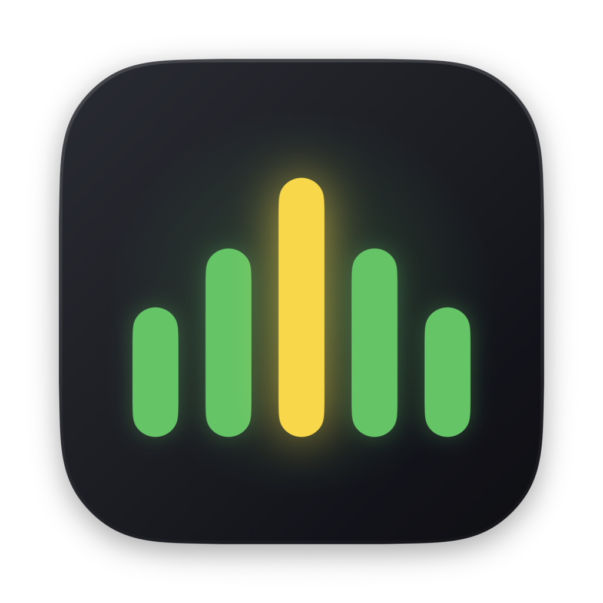
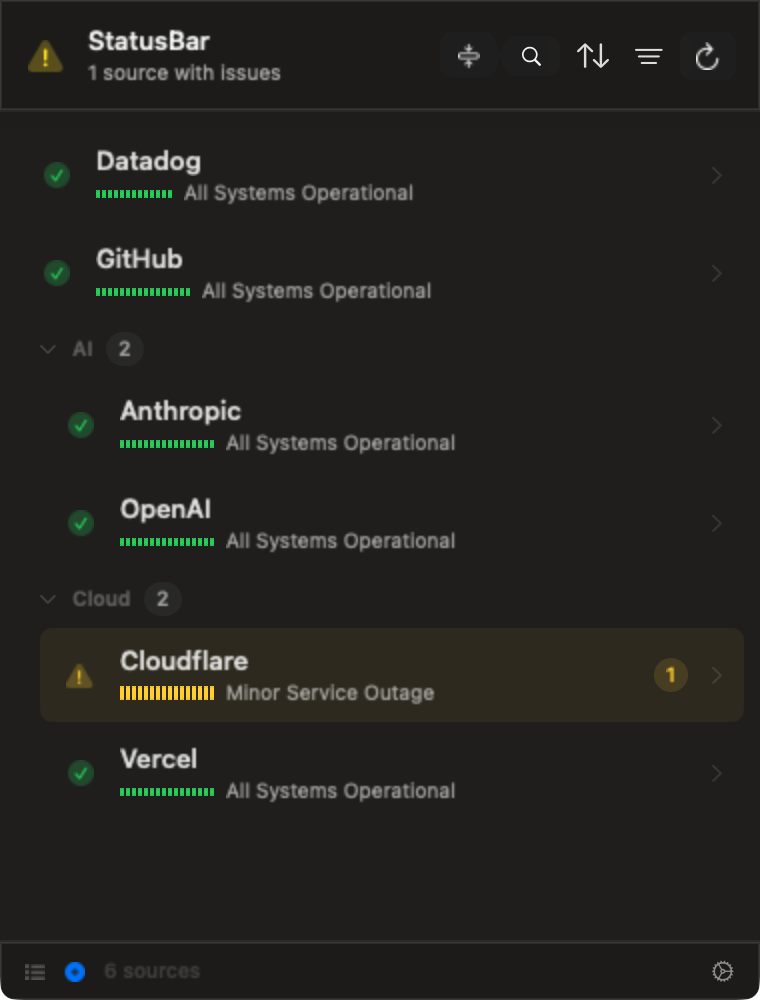
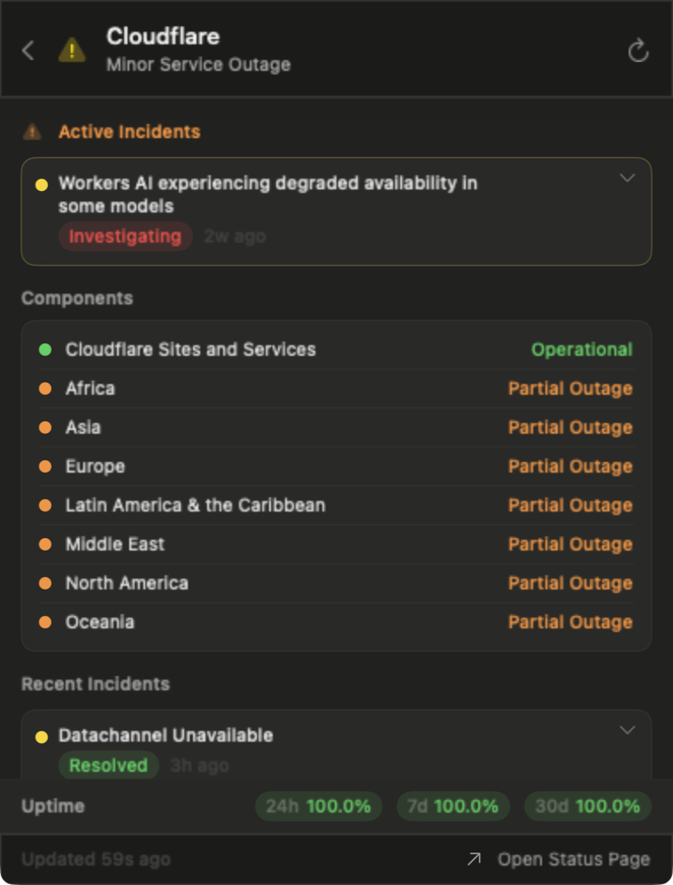

<p align="center">
  
</p>

<h1 align="center">StatusBar</h1>

<p align="center">
  <strong>Every status page you care about — the services you depend on and the infrastructure you run — in one menu bar icon.</strong><br>
  A native SwiftUI menu bar app supporting <a href="https://www.atlassian.com/software/statuspage">Atlassian Statuspage</a>, <a href="https://incident.io">incident.io</a>, <a href="https://instatus.com">Instatus</a>, and self-hosted <a href="https://gatus.io">Gatus</a> with automatic provider detection. Free, open source, zero telemetry.
</p>

<p align="center">
  
  
  <a href="LICENSE"></a>
  <a href="https://github.com/alexnodeland/StatusBar/actions/workflows/ci.yml"></a>
  <a href="https://github.com/alexnodeland/StatusBar/releases/latest"></a>
  <a href="https://alexnodeland.github.io/StatusBar/"></a>
</p>

<p align="center">
  
  
</p>

## ✨ Features

🟢 **Monitoring** — Menu bar icon reflects the worst status across all sources (green → yellow → orange → red) with a badge showing how many have issues. Drill into any source to see components, active incidents, update timelines, and 24h/7d/30d uptime with per-check sparklines.

📋 **Sources** — Add, edit, group, search, sort, and filter sources; snooze noisy ones for an hour or a day. Bulk import/export as JSON — full configuration export bundles settings, sources, and webhooks into a single versioned file. Sources refresh concurrently on a configurable interval (1–15 min).

📣 **Webhooks** — Push status changes to Slack (Block Kit), Discord (embeds), Microsoft Teams (Adaptive Cards), or any JSON endpoint — with per-webhook labels and real delivery feedback on test sends.

🔗 **URL Scheme** — Control the app from Terminal, browsers, Raycast, or Shortcuts with `statusbar://` deep links. Open the popover, navigate to a source, trigger a refresh, add/remove sources, or jump to a settings tab.

🪝 **Script Hooks** — Drop executable scripts into the hooks directory and they run automatically on status events (status changes, refreshes, source add/remove). Event details arrive as environment variables and JSON on stdin.

🍎 **AppleScript** — Full Cocoa Scripting support. Query sources and status from Script Editor, JXA, `osascript` one-liners, or any OSA-compatible tool. Refresh, add, and remove sources programmatically.

⚙️ **Settings** — Status change notifications with per-source alert levels, a rebindable global hotkey (default ⌃⌥S), menu bar display options, automatic update checks with in-app release notes, and launch at login. Runs as a pure menu bar agent with no Dock icon.

## 📦 Install

### Homebrew (recommended)

```bash
brew tap alexnodeland/tap
brew install --cask statusbar
```

### Manual download

1. Download `StatusBar-vX.Y.Z.dmg` (or the `.zip`) from the [Releases page](https://github.com/alexnodeland/StatusBar/releases/latest)
2. Drag `StatusBar.app` to `/Applications`
3. Remove quarantine: `xattr -cr /Applications/StatusBar.app`
4. Launch normally

Runs natively on both Apple Silicon and Intel Macs.

## 🔗 Sources

The app ships with three default sources:

| Name | URL |
|------|-----|
| Anthropic | `https://status.anthropic.com` |
| GitHub | `https://www.githubstatus.com` |
| Cloudflare | `https://www.cloudflarestatus.com` |

Open **Settings** and click **+** to add more. The app auto-detects the provider — no configuration needed.

<details>
<summary>Example sources</summary>

| Service | Provider | URL |
|---------|----------|-----|
| Atlassian | Atlassian Statuspage | `https://status.atlassian.com` |
| Datadog | Atlassian Statuspage | `https://status.datadoghq.com` |
| Linear | incident.io | `https://linearstatus.com` |
| Notion | Atlassian Statuspage | `https://status.notion.so` |
| Zed | Instatus | `https://status.zed.dev` |
| Deno | Instatus | `https://denostatus.com` |
| Gatus demo | Gatus | `https://status.twin.sh` |

</details>

> **Note:** Incident history detail varies by provider. Atlassian Statuspage sources include full incident timelines. incident.io and Instatus sources may have limited or unavailable incident details due to provider API restrictions. Gatus sources report per-endpoint health (each endpoint appears as a component) but have no incident history.

Sources are persisted as JSON via `@AppStorage` and survive restarts. Use **Settings → Data** to export/import a full configuration (settings, sources, webhooks) or sources only.

## 🔗 URL Scheme

Control the app from anywhere using `statusbar://` URLs:

```bash
open "statusbar://open"                                          # Show popover
open "statusbar://open?source=GitHub"                            # Navigate to source
open "statusbar://refresh"                                       # Refresh all sources
open "statusbar://add?url=https://status.openai.com&name=OpenAI" # Add a source
open "statusbar://remove?name=GitHub"                            # Remove a source
open "statusbar://settings"                                      # Open settings
open "statusbar://settings?tab=webhooks"                         # Open settings tab
```

Works with Terminal, browsers, Raycast, Alfred, macOS Shortcuts, and anything that can open URLs.

## 🪝 Script Hooks

Place executable scripts in `~/Library/Application Support/StatusBar/hooks/` and they run automatically on status events. Use **Settings → Hooks → Add Example Hook** to create a starter script.

**Events:**

| Event | When |
|-------|------|
| `on-status-change` | A source's status severity changes (e.g. none → major) |
| `on-refresh` | All sources finish refreshing |
| `on-source-add` | A new source is added |
| `on-source-remove` | A source is removed |

**Environment variables:**

| Variable | Events |
|----------|--------|
| `STATUSBAR_EVENT` | All |
| `STATUSBAR_SOURCE_NAME` | status-change, add, remove |
| `STATUSBAR_SOURCE_URL` | status-change, add, remove |
| `STATUSBAR_TITLE` / `STATUSBAR_BODY` | status-change |
| `STATUSBAR_SOURCE_COUNT` / `STATUSBAR_WORST_LEVEL` | refresh |

A full JSON payload is also piped to stdin. Scripts can be any language (bash, python, etc.) — just add a shebang and make them executable. 30-second timeout per execution.

<details>
<summary>Example hook</summary>

```bash
#!/bin/bash
# Log status changes to a file
[ "$STATUSBAR_EVENT" = "on-status-change" ] || exit 0

LOG="$HOME/Library/Logs/StatusBar/hooks.log"
mkdir -p "$(dirname "$LOG")"
echo "[$(date)] $STATUSBAR_SOURCE_NAME: $STATUSBAR_TITLE" >> "$LOG"
```

</details>

## 🍎 AppleScript

StatusBar exposes a full scripting dictionary for AppleScript and JXA (JavaScript for Automation). Open Script Editor → File → Open Dictionary → StatusBar to browse it.

```applescript
tell application "StatusBar"
    get name of every source           -- list source names
    get status of source "GitHub"      -- "none" / "minor" / "major" / "critical" / "unknown"
    get worst status                   -- aggregate worst status
    get issue count                    -- number of sources with issues

    refresh                            -- trigger immediate refresh
    add source "https://status.openai.com" named "OpenAI"
    remove source "OpenAI"
end tell
```

Works from Terminal too:

```bash
osascript -e 'tell application "StatusBar" to get name of every source'
osascript -e 'tell application "StatusBar" to get worst status'
osascript -e 'tell application "StatusBar" to refresh'
```

<details>
<summary>Source properties</summary>

| Property | Type | Description |
|----------|------|-------------|
| `id` | text | Unique identifier (UUID) |
| `name` | text | Display name |
| `url` | text | Base URL of the status page |
| `status` | text | Current indicator (`none`, `minor`, `major`, `critical`, `unknown`) |
| `status description` | text | Human-readable status |
| `alert level` | text | Alert level setting |
| `group` | text | Group name (empty string if ungrouped) |

</details>

## ❤️ Support

StatusBar is free and open source. If it saves you a tab or a headache, you can [support development on Gumroad](https://ournature.gumroad.com/l/statusbar) for $2.99 — or star the repo and tell a friend.

Questions or problems? [Open an issue](https://github.com/alexnodeland/StatusBar/issues) or email [alex@ournature.studio](mailto:alex@ournature.studio). See the [changelog](CHANGELOG.md) and [privacy policy](PRIVACY.md) (short version: zero telemetry).

## 🛠 Development

```bash
make setup                            # One-time: brew bundle + git hooks
make build                            # Dev build
make test                             # Run tests
make check                            # Full CI check (lint + format + test)
make release                          # Release build (universal binary + ZIP)
```

See [CONTRIBUTING.md](.github/CONTRIBUTING.md) for the full development guide.

## 🤝 Contributing

See [CONTRIBUTING.md](.github/CONTRIBUTING.md) for build instructions, architecture overview, and roadmap.
